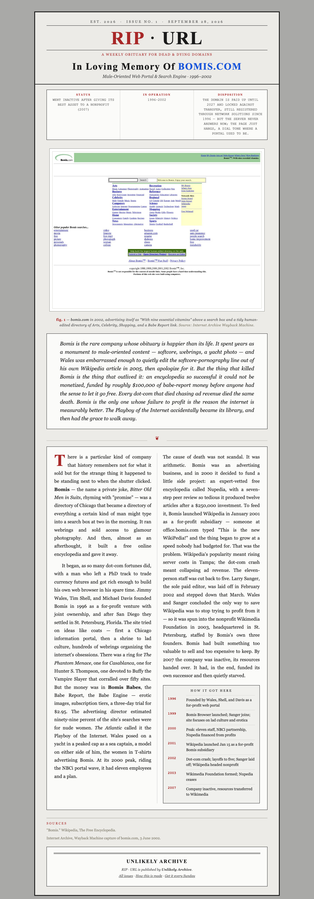

# RIP · URL

**A weekly obituary for dead websites — written by a machine held to an archivist's rules.**

Every Sunday, with no human in the loop, a scheduled job finds a website that once mattered and no
longer exists, proves it's actually dead, gathers the record of its life, and publishes an
illustrated obituary: how it rose, what really killed it, and what its address does now.

**Live:** https://ripurl.val.run · **How it works, for readers:** https://ripurl.val.run/about



## The problem worth solving

Letting a language model write about real companies unsupervised fails in predictable ways: it
picks the wrong subject, fills gaps from memory, and states guesses as facts. This project treats
those as engineering problems, not prompt problems — each failure mode has a mechanical guard.

| Failure | Guard |
|---|---|
| Writing an obituary for something alive | Five hard gates before anything is written, including a live check of what the URL does today (dark, parked, redirected, repurposed…) |
| Wrong subject (an acquirer's homepage listed as the dead company's site) | The domain must match the company's own name or initials |
| Facts from memory | The writer sees only the evidence file the pipeline fetched, and must refuse rather than pad |
| Confident errors that slip through | An independent fact-check call audits every draft; flagged claims get a surgical revision, and a candidate that can't pass is dropped |
| Captions that don't match the picture | The writer and checker both see the archived screenshot; the archive citation is built from evidence, not generated |
| Broken or empty hero images | Archive-error detection before rendering; automatic trimming of dead space |

Every published issue's full evidence file is public at `/issue/N/evidence`.

## How it runs

A TypeScript state machine on [Val Town](https://www.val.town/). A cron ticks every 15 minutes and
advances the week's job exactly one stage, so no run is ever long, retries are free, and a bad
candidate just hands off to the next finalist:

```
discover → vet (×n) → evidence → screenshot → generate ⇄ verify → publish → deliver (×n)
```

Sources: Wikidata (dissolved organisations with an official website), Wikipedia (the story), the
Internet Archive (history and screenshots, rendered by WordPress mShots), RDAP (who still pays for
the domain). Claude writes and fact-checks. Everything except the Claude calls is free.

Full design: [`AUTOMATION.md`](AUTOMATION.md).

## What the pilot taught

An 11-issue pilot ran unattended from July to September 2026 and was retired before launch. It
wrote an obituary for oracle.com (listed in Wikidata as JD Edwards' website), for a band whose site
is still up, and for a company that still exists — because a recorded *company* death was treated as
proof of a *URL's* death. It also turned out every issue had been written from a single paragraph:
the Wikipedia API silently truncated the evidence. The relaunch fixed both at the root and added the
fact-check, whose first run on a real draft found seven unsupported claims.

## Tradeoffs

- **No human approval before publishing.** Full automation gives up the editor's taste check. In its
  place: hard gates before anything is written, evidence-only writing, an independent fact-check, and
  an owner copy of every issue for repair after the fact ([`AUTOMATION.md` §0](AUTOMATION.md)).
- **When unsure, the site counts as alive.** A bot wall, server error or unreadable page disqualifies
  a candidate. Skipping a real corpse costs one candidate; an obituary for a living site costs the
  publication its credibility.
- **One stage per 15-minute tick, not one long run.** Every run stays inside Val Town's time limit,
  a failed stage just retries next tick, and a bad candidate hands off to the next finalist.
- **Surgical revisions, not rewrites.** Full rewrites fixed flagged claims but invented new ones and
  never converged; changing only the flagged claims passes in one or two rounds.
- **Free wherever possible.** Every source and the hosting are free; only the Claude calls cost money,
  well under $1 an issue. The price is limits: Gmail's ~500 recipients a day, and no Substack API.

## Repository

| Path | What |
|---|---|
| `val/` | The production pipeline and website (mirror of the Val Town val; `cd val && vt pull` to sync) |
| `tests/` | Offline tests: the corpse gate against faked site responses, the name gate, scoring |
| `val/scripts/` | Regression check for the liveness gate, dry-run preview, audit and revision tools |
| `AUTOMATION.md` | Architecture and design decisions |

## Running it

The val runs on Val Town's free tier. To run your own copy, remix the val and set
`ANTHROPIC_API_KEY`, `RIPURL_BASE_URL` and `RUN_TOKEN` (see `AUTOMATION.md` §7). Then:

- `deno test --allow-import --allow-env tests/` — offline tests for the corpse gate and the name gate, with
  every website response faked (no network, no keys)
- `scripts/check_liveness.ts` — verify the corpse gate against known live and dead domains (live network)
- `scripts/preview_issue.ts` — dry-run a full issue (run repeatedly; one stage per run)
- `POST /run?token=…` — start a real issue outside the Sunday window
